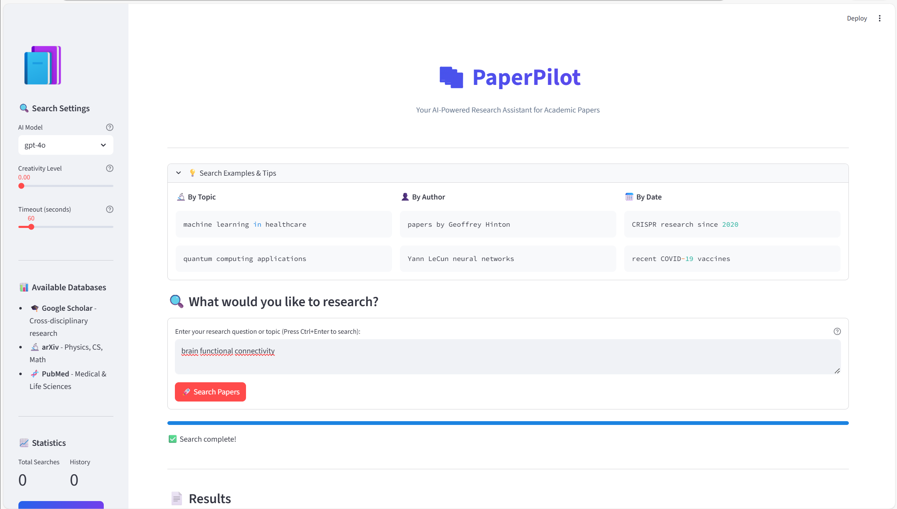
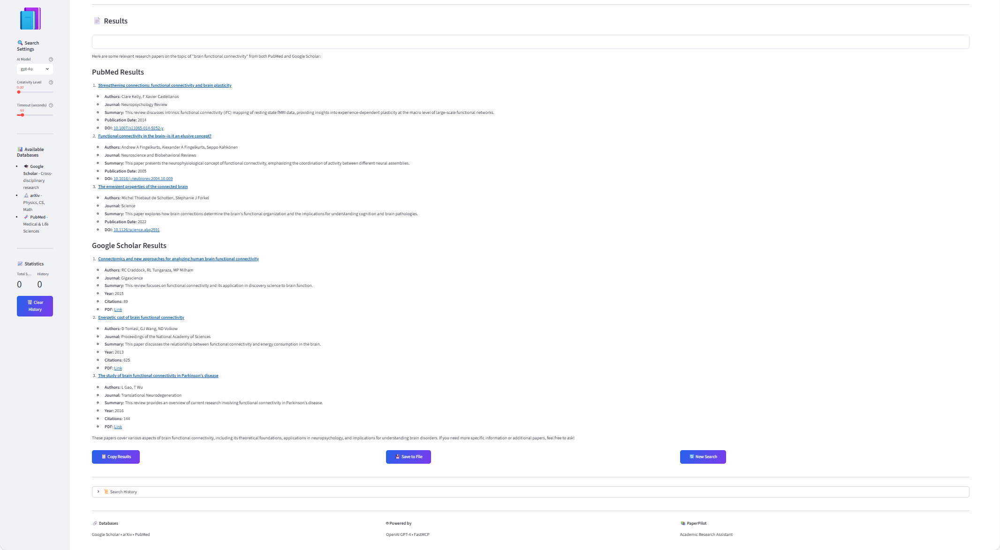
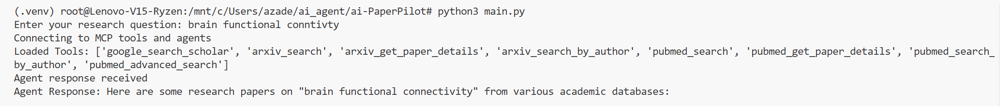

# 📚 PaperPilot - AI Research Assistant

<div align="center">



**Your AI-Powered Research Assistant for Academic Papers**

[](https://www.python.org/downloads/)
[](https://streamlit.io/)
[](https://openai.com/)
[](LICENSE)

</div>

---

## 🌟 Overview

PaperPilot is an intelligent research assistant that helps you search and analyze academic papers across multiple databases using AI. Powered by OpenAI's GPT-4 and the Model Context Protocol (MCP), it provides a seamless interface to access:

- 🎓 **Google Scholar** - Cross-disciplinary academic research
- 🔬 **arXiv** - Computer Science, Physics, Mathematics, and Engineering
- 🧬 **PubMed** - Medical and Life Sciences research

## ✨ Key Features

- **🤖 AI-Powered Search** - Natural language queries powered by GPT-4
- **🔍 Multi-Database Access** - Search across Google Scholar, arXiv, and PubMed simultaneously
- **⚡ Real-Time Results** - Fast, asynchronous search with progress tracking
- **🎯 Smart Filtering** - Sort by relevance, date, author, and more
- **📊 Beautiful UI** - Clean, modern Streamlit interface with gradient styling
- **💾 Export Results** - Save search results to text files
- **📜 Search History** - Keep track of your previous searches
- **🔒 Secure** - Environment-based credential management

## 🖼️ Screenshots

### Main Interface


### MCP Server Connections

<table>
  <tr>
    <td></td>
    <td></td>
  </tr>
  <tr>
    <td align="center"><b>Serper Server (Port 8001)</b></td>
    <td align="center"><b>arXiv Server (Port 8002)</b></td>
  </tr>
  <tr>
    <td colspan="2"></td>
  </tr>
  <tr>
    <td colspan="2" align="center"><b>PubMed Server (Port 8003)</b></td>
  </tr>
</table>

### Tools List


## 🚀 Quick Start

### Prerequisites

- Python 3.10 or higher
- OpenAI API Key
- Serper API Key (for Google Scholar)
- Valid email address (for PubMed)

### Installation

1. **Clone the repository**
   ```bash
   git clone https://github.com/yourusername/ai-PaperPilot.git
   cd ai-PaperPilot
   ```

2. **Create and activate virtual environment**
   ```bash
   python -m venv .venv
   
   # Windows
   .venv\Scripts\activate
   
   # macOS/Linux
   source .venv/bin/activate
   ```

3. **Install dependencies**
   ```bash
   pip install -r requirements.txt
   ```

4. **Configure environment variables**
   ```bash
   cp .env.example .env
   ```
   
   Edit `.env` and add your API keys:
   ```env
   OPENAI_API_KEY=your_openai_api_key_here
   SERPER_API_KEY=your_serper_api_key_here
   NCBI_EMAIL=your_email@example.com
   ```

### Running PaperPilot

PaperPilot requires **3 MCP servers** to be running simultaneously. Open **4 terminals**:

**Terminal 1 - Serper Server (Google Scholar)**
```bash
cd ai-PaperPilot
source .venv/bin/activate  # or .venv\Scripts\activate on Windows
python tools/serper.py
```

**Terminal 2 - arXiv Server**
```bash
cd ai-PaperPilot
source .venv/bin/activate
python tools/arxiv_tool.py
```

**Terminal 3 - PubMed Server**
```bash
cd ai-PaperPilot
source .venv/bin/activate
python tools/pubmed_tool.py
```

**Terminal 4 - Streamlit App**
```bash
cd ai-PaperPilot
source .venv/bin/activate
streamlit run main.py
```

The application will open in your browser at `http://localhost:8501` 🎉

## 📖 Usage

### Basic Search
1. Enter your research question in the text area
2. Press **Ctrl+Enter** or click **"🚀 Search Papers"**
3. View results from all three databases

### Search Examples
```
✅ "machine learning in healthcare"
✅ "papers by Geoffrey Hinton on neural networks"
✅ "CRISPR gene editing applications since 2020"
✅ "brain functional connectivity using fMRI"
```

### Advanced Settings
- **AI Model**: Choose between GPT-4o, GPT-4o-mini, or GPT-4-turbo
- **Creativity Level**: Adjust temperature (0 = precise, 1 = creative)
- **Timeout**: Set maximum wait time for responses

## 🏗️ Architecture

```
PaperPilot/
├── main.py                    # Streamlit UI application
├── mcp_server/
│   └── client.py             # MCP client & agent instance
├── models/
│   └── llm_openai.py         # OpenAI LLM configuration
├── prompts/
│   └── prompt.py             # Task and security prompts
├── tools/
│   ├── serper.py             # Google Scholar MCP server (port 8001)
│   ├── arxiv_tool.py         # arXiv MCP server (port 8002)
│   └── pubmed_tool.py        # PubMed MCP server (port 8003)
└── pics/                      # Screenshots and images
```

## 🔧 Technology Stack

- **Frontend**: Streamlit
- **AI/LLM**: OpenAI GPT-4 via LangChain
- **MCP Framework**: FastMCP (Model Context Protocol)
- **Search APIs**: 
  - Serper.dev (Google Scholar)
  - arXiv API (via `arxiv` package)
  - PubMed E-utilities (via Biopython)
- **Agent Framework**: LangGraph with ReAct pattern

## 🛠️ Available Tools

### Google Scholar (Serper)
- **Tool**: `google_search_scholar`
- **Purpose**: Search scholarly articles with citations
- **Max Results**: 20 papers

### arXiv
- **Tools**: 
  - `arxiv_search` - Search by keywords
  - `arxiv_get_paper_details` - Get paper by arXiv ID
  - `arxiv_search_by_author` - Find papers by author
- **Max Results**: 50 papers

### PubMed
- **Tools**:
  - `pubmed_search` - Search biomedical literature
  - `pubmed_get_paper_details` - Get paper by PMID
  - `pubmed_search_by_author` - Find papers by author
  - `pubmed_advanced_search` - Multi-filter search
- **Max Results**: 100 papers

## 📝 Configuration Files

### `.env` (Required)
```env
OPENAI_API_KEY=sk-proj-...
SERPER_API_KEY=your_key_here
NCBI_EMAIL=your_email@example.com
```

### `requirements.txt`
```txt
langchain_openai
python-dotenv
arxiv
biopython
langchain-mcp-adapters
langgraph
fastmcp
streamlit
black
```

## 🔐 Security Features

- ✅ Environment variable-based credential management
- ✅ No hardcoded API keys in source code
- ✅ Security prompts to prevent credential leakage
- ✅ Validation of all input parameters
- ✅ Error handling with safe error messages

## 🤝 Contributing

Contributions are welcome! Please feel free to submit a Pull Request.

1. Fork the repository
2. Create your feature branch (`git checkout -b feature/AmazingFeature`)
3. Commit your changes (`git commit -m 'Add some AmazingFeature'`)
4. Push to the branch (`git push origin feature/AmazingFeature`)
5. Open a Pull Request

## 📄 License

This project is licensed under the MIT License - see the [LICENSE](LICENSE) file for details.

## 🙏 Acknowledgments

- [OpenAI](https://openai.com/) for GPT-4 API
- [Serper.dev](https://serper.dev/) for Google Scholar search
- [arXiv](https://arxiv.org/) for open access to research papers
- [PubMed/NCBI](https://pubmed.ncbi.nlm.nih.gov/) for biomedical literature
- [Streamlit](https://streamlit.io/) for the amazing UI framework
- [FastMCP](https://github.com/jlowin/fastmcp) for MCP server implementation

## 📧 Contact

For questions or support, please open an issue on GitHub.

---

<div align="center">

**Made with ❤️ for researchers and academics**

⭐ Star this repo if you find it helpful!

</div>
